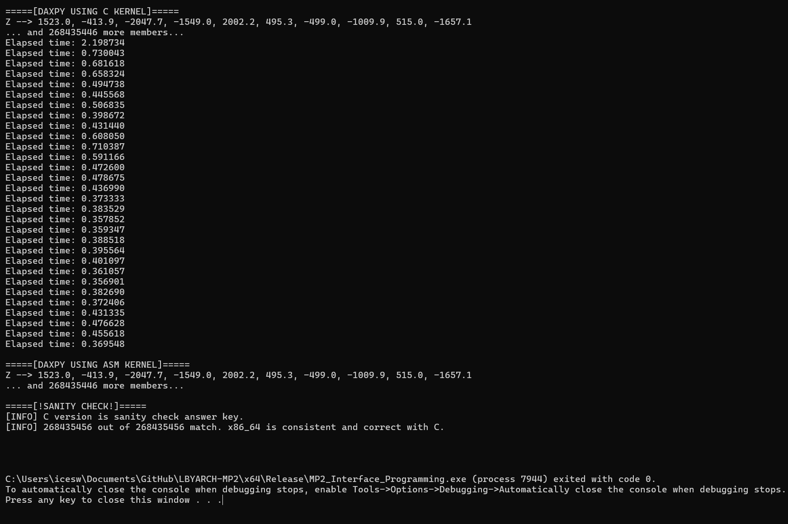

# LBYARCH-MP2
## x86-to-C interface programming project
The program runs two versions of the DAXPY function: one implemented in C and the other implemented in NASM (x86_64 assembly language). The DAXPY function computes the result of A * X + Y where A is a scalar and X and Y are vectors. The program also outputs the average runtime for each kernel, providing insights into the performance of the C and NASM implementations of the DAXPY function.

### Generating Test Cases
In order to generate test cases, a *main_test.py* function can be found in the *\_\_tests\_\_* folder. Running this file will automatically generate the values for n, A, X, and Y. Note that the size of the vectors should be changed according to the size wanted. 

### Running the Program
To run the program, open the *.sln* file. Then, build and run the *main.c* file. The program will prompt you for a file input, and you may input any .txt file found in the *\_\_tests\_\_* folder that were previously generated by *main_test.py*.

## Kernel Performance Analysis
The 

### Average Execution Time in Debug Mode
| Vector Length  | C Kernel |  x86_64 Kernel
| ------------- | ------------- | ----------- | 
| 220  | 2.788 ms  |  1.060 ms |
| 224  | 63.631 ms |  23.169 ms |
| 228  |   |           |

### Average Execution Time in Release Mode
| Vector Length  | C Kernel |  x86_64 Kernel
| ------------- | ------------- | ----------- | 
| 220  | 1.185 ms  |  1.051 ms |
| 224  | 21.100 ms |  22.388 ms |
| 228  | 2637.284 ms  | 1379.334 ms |

## Analysis

When running the program in debug mode, it is apparent that the NASM kernel is far faster than the C program, and the runtime exponentially increases the bigger the vector size becomes. However, when running it in release mode, the difference becomes smaller, and in certain cases C outperforms the NASM kernel as well. This suggests that the optimization that occurs when the program is released in release mode significantly improves the performance of the programs, particularly the C kernel's. For instance, the C kernel's performance improves by 202% for the vector length of 224 when it's executed in release mode. This underscores the importance of optimization techniques as well as compiler settings.

[Insert analysis here]

## Runtime per iteration
Below is a breakdown of the runtime for each of the 30 iterations that were performed for each category. The size of each vector is indicated for each test performed.

## (DEBUG MODE)
### 220 for C (left) and NASM (right)

### 224 for C (left) and NASM (right)

### 228 for C (left) and NASM (right)

## (RELEASE MODE)
### 220 for C (left) and NASM (right)

### 224 for C (left) and NASM (right)

### 2^28 for C (left) and NASM (right)

## Output with Correctness Check
In order to validate the result of our NASM kernel, we compared the output with its C counterpart. Below is a sample result when a category is checked. We ensured that every run had NASM results that matched with the C kernel.

## Members
This project was created by Francis Benedict Martinez and Krizchelle Wong

